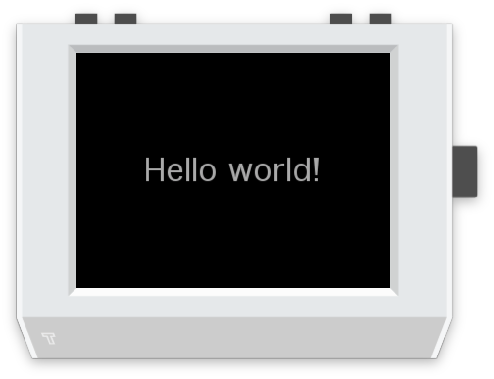
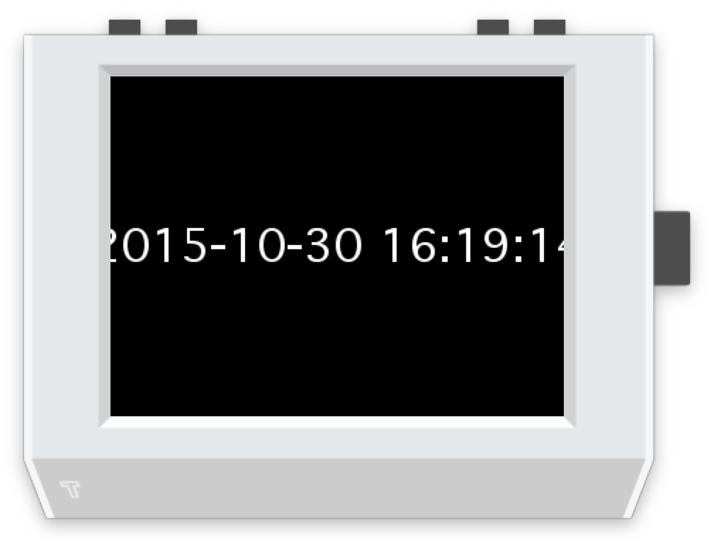
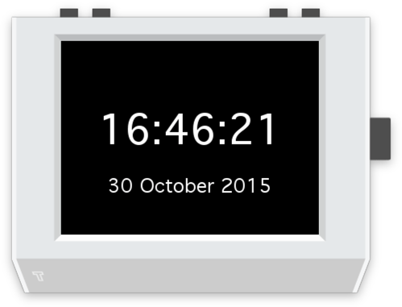

Getting started
===============

A clean slate
-------------

Open up Tide and choose File -> New.

You'll be presented with the app template, which looks like this:

.. code-block:: python
   :caption: `Run this in Tide! <tide-app-source:///?code=import+tingbot%0Afrom+tingbot+import+%2A%0A%0A%23+setup+code+here%0A%0Adef+loop%28%29%3A%0A++++%23+drawing+code+here%0A++++screen.fill%28color%3D%27black%27%29%0A++++screen.text%28%27Hello+world%21%27%29%0A%0A%23+run+the+app%0Atingbot.run%28loop%29%0A>`__

   import tingbot
   from tingbot import *

   # setup code here

   def loop():
       # drawing code here
       screen.fill(color='black')
       screen.text('Hello world!')

   # run the app
   tingbot.run(loop)

This program just writes 'Hello world' to the screen. Try running it! Click the Run button in the 
top left of the Tide window to run this code in the simulator. It'll look like this:

This program consists of a few parts-

Import 
~~~~~~

.. code-block:: python

   import tingbot
   from tingbot import *

At the start, we *import* some functionality into the program. Here, we're importing everything from
the  tingbot libraries, so we can use ``screen`` to draw things to the screen. There are lots of
things  you can import, like ``import requests`` for getting data from the internet, or ``import
time`` to access the system clock.

Setup
~~~~~

.. code-block:: python

   # setup code here

This part contains code that runs when your app starts. For this app, there's no setup required, so
there's just a comment. 

.. note::

    Comments begin with ``#``, are used as notes-to-self, or notes to others reading this program,
    and have no effect on how the program runs.

Loop
~~~~

.. code-block:: python

   def loop():
       # drawing code here
       screen.fill(color='black')
       screen.text('Hello world!')

In this function, ``loop()``, we draw to the screen. This function is run repeatedly while your
program is running.

.. note::

    Functions are little bits of code that can be 'called' (meaning run) repeatedly from different
    parts of the program. This loop function is given to the `tingbot.run()` to draw the screen.

Run
~~~

.. code-block:: python

   tingbot.run(loop)

Finally we run the program. This line causes the ``loop()`` function to be called over and over, drawing
to the screen.

Make a change
-------------

Let's try making a change to our app. We can change the colors using the `color` parameter.

.. code-block:: python
   :caption: `Run this in Tide! <tide-app-source:///?code=import+tingbot%0Afrom+tingbot+import+%2A%0A%0A%23+setup+code+here%0A%0Adef+loop%28%29%3A%0A++++%23+drawing+code+here%0A++++screen.fill%28color%3D%27white%27%29%0A++++screen.text%28%27Hello+world%21%27%2C+color%3D%27blue%27%29%0A%0A%23+run+the+app%0Atingbot.run%28loop%29%0A>`__
   :name: example2

   import tingbot
   from tingbot import *

   # setup code here

   def loop():
       # drawing code here
       screen.fill(color='white')
       screen.text('Hello world!', color='blue')

   # run the app
   tingbot.run(loop)

Your first app - a digital clock
--------------------------------

For this app we're going to import some functionality from the Python `time
<https://docs.python.org/2/library/time.html>`_  module.

.. code-block:: python
   :caption: `Run this in Tide! <tide-app-source:///?code=import+tingbot%0Afrom+tingbot+import+%2A%0Aimport+time%0A%0Adef+loop%28%29%3A%0A++++current_time+%3D+time.strftime%28%22%25Y-%25m-%25d+%25H%3A%25M%3A%25S%22%29%0A++++%0A++++screen.fill%28%0A++++++++color%3D%27black%27%0A++++%29%0A++++screen.text%28%0A++++++++current_time%2C+%0A++++++++color%3D%27white%27%0A++++%29%0A%0Atingbot.run%28loop%29%0A>`__

   import tingbot
   from tingbot import *
   import time

   def loop():
       current_time = time.strftime("%Y-%m-%d %H:%M:%S")
       
       screen.fill(
           color='black'
       )
       screen.text(
           current_time, 
           color='white'
       )

   tingbot.run(loop)

A few things have changed in the above- we've removed the comments and split the ``fill`` and 
``text`` calls to multiple lines. This is just to make it easier to read.

We've also added a call to ``time.strftime``.

.. tip::
   
   Wondering where we got ``time.strftime`` from? The module ``time`` is part of Python, so it's
   always available, and you can learn about it from the `Python docs
   <https://docs.python.org/2/library/index.html>`_.

   We found it by Googling '`current time python
   <https://google.com/search?q=current+time+python>`_' and checking the first search result!

So now instead of writing 'Hello world' to the screen, we're writing the current time. It looks like
this:

We're getting there! 

.. note::

   Wondering what the ``current_time`` is? It's a *variable*. Variables are a way to carry data
   around in a program. So on the line ``current_time = time.strftime("%Y-%m-%d %H:%M:%S")`` we
   created and set the variable, and we used it in the ``screen.text`` call.

Let's just adjust the formatting.

.. code-block:: python
   :caption: `Run this in Tide! <tide-app-source:///?code=import+tingbot%0Afrom+tingbot+import+%2A%0Aimport+time%0A%0Adef+loop%28%29%3A%0A++++current_date+%3D+time.strftime%28%22%25d+%25B+%25Y%22%29%0A++++current_time+%3D+time.strftime%28%22%25H%3A%25M%3A%25S%22%29%0A++++%0A++++screen.fill%28%0A++++++++color%3D%27black%27%0A++++%29%0A++++screen.text%28%0A++++++++current_time%2C+%0A++++++++xy%3D%28160%2C+110%29%2C%0A++++++++color%3D%27white%27%2C%0A++++++++font_size%3D50%2C%0A++++%29%0A++++screen.text%28%0A++++++++current_date%2C%0A++++++++xy%3D%28160%2C+180%29%2C%0A++++++++color%3D%27white%27%2C%0A++++++++font_size%3D24%2C%0A++++%29%0A%0Atingbot.run%28loop%29%0A>`__

   import tingbot
   from tingbot import *
   import time

   def loop():
       current_date = time.strftime("%d %B %Y")
       current_time = time.strftime("%H:%M:%S")
       
       screen.fill(
           color='black'
       )
       screen.text(
           current_time, 
           xy=(160, 110),
           color='white',
           font_size=50,
       )
       screen.text(
           current_date,
           xy=(160, 180),
           color='white',
           font_size=24,
       )

   tingbot.run(loop)

Not bad for 25 lines!
